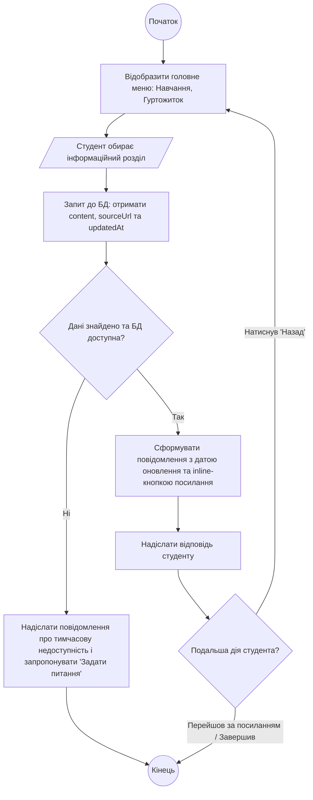

# Activity Diagram: UC-01 Отримання статичної інформації

- **Автор:** Савченко Олексій (ТР-42)
- **Пов'язаний сценарій:** UC-01 (`docs/use-cases.md`)

```mermaid
flowchart TD
    Start((Початок)) --> ShowMenu[Відобразити головне меню: Навчання, Гуртожиток]
    ShowMenu --> SelectSection[/Студент обирає інформаційний розділ/]
    SelectSection --> QueryDB[Запит до БД: отримати content, sourceUrl та updatedAt]
    
    QueryDB --> CheckSuccess{Дані знайдено та БД доступна?}
    CheckSuccess -- Ні --> SendFallback[Надіслати повідомлення про тимчасову недоступність і запропонувати 'Задати питання']
    SendFallback --> End((Кінець))
    
    CheckSuccess -- Так --> BuildMsg[Сформувати повідомлення з датою оновлення та inline-кнопкою посилання]
    BuildMsg --> SendMsg[Надіслати відповідь студенту]
    SendMsg --> NextAction{Подальша дія студента?}
    
    NextAction -- Натиснув 'Назад' --> ShowMenu
    NextAction -- Перейшов за посиланням / Завершив --> End
```